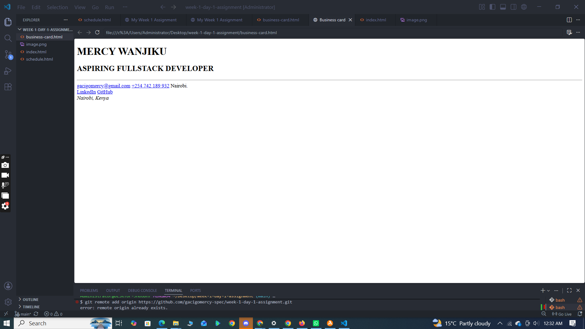
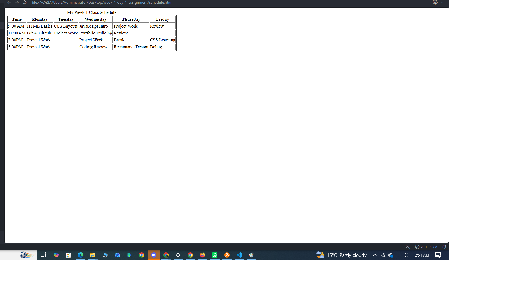

# Week 1 Day 1 Assignment — HTML from Scratch

A beginner project practicing core HTML: document structure, semantic elements, and tables — built entirely from scratch as part of the Mctaba Learning Academy Fullstack and AI Engineering course.

## Pages

- **index.html** — a personal "about me" page with an intro, hobbies, and a list of learning goals
- **business-card.html** — a semantic HTML digital business card with contact info and social links
- **schedule.html** — a weekly class schedule built with an HTML table, including a merged (colspan) cell

## Setup

1. Clone this repository
2. Open the folder in VS Code
3. Right-click any `.html` file → "Open with Live Server" to view it in the browser

## Screenshots

### Index Page

### Business Card

### Class Schedule

